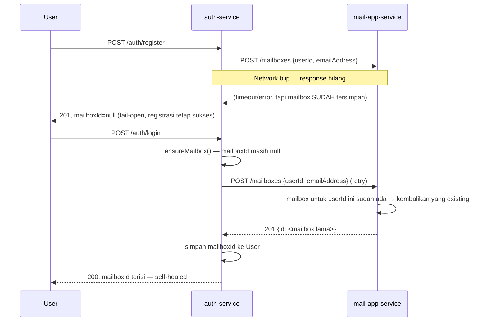

# SendagoMail — Arsitektur

> Direvisi total supaya sesuai kode aktual di repo ini (sebelumnya dokumen ini
> mendeskripsikan stack aspirational — Go/Laravel/Next.js/Kafka/ClickHouse/MinIO — yang
> tidak pernah diimplementasikan). Rujukan desain fitur tetap di `docs/BRD_SendagoMail.docx`,
> `docs/SRS_SendagoMail.docx`, `docs/PRD_SendagoMail.md` — lihat `README.md`.

## Vision

Platform email multi-tenant berbasis domain sendiri (self-hosted), dengan REST API untuk
kirim email transaksional (OTP, notifikasi, dsb), webmail custom, kalender, tugas, dan
automation rules per mailbox.

## High Level Architecture

```text
Browser (apps/web — React + Vite, webmail/kalender/tugas end user)
Browser (apps/admin-dashboard — panel Tenant Admin & Super Admin) [BARU README, belum ada kode]
      │
      ▼
API Gateway (services/api-gateway — Express + http-proxy-middleware, reverse proxy per prefix)
      │
      ├── /auth, /users            → auth-service
      ├── /tenants, /domains       → domain-provisioning
      ├── /mailboxes, /folders,
      │   /emails                  → mail-app-service
      ├── /calendar-events, /tasks → calendar-task-service
      └── /automation-rules        → automation-engine

      (rute /internal/* diblokir eksplisit di gateway — endpoint service-to-service
       hanya boleh dipanggil langsung antar service, diproteksi X-Internal-Api-Key)
      │
      ▼
──────────────────────────────────────────────────────────────
auth-service            — identity, JWT, refresh token, API credential (memberId+secret)
domain-provisioning     — tenant, domain, rekomendasi DNS (MX/SPF/DKIM/DMARC)
mail-app-service        — mailbox, folder, email (compose/inbox/search/recall), template,
                           POST /emails/api-send (kirim email transaksional via credential)
calendar-task-service   — kalender & tugas
automation-engine       — automation rules (filter/forward/auto-reply/delete/ai_agent)
──────────────────────────────────────────────────────────────
PostgreSQL 16 — SATU instance, database terpisah per service (lihat bagian Database)
──────────────────────────────────────────────────────────────
mail-engine (docker-compose terpisah): Postfix + Dovecot + Rspamd + ClamAV
──────────────────────────────────────────────────────────────
```

**Tidak ada** message broker (Kafka/RabbitMQ), cache layer (Redis), object storage
(MinIO/S3), atau analytics store (ClickHouse) di infra saat ini — semua itu aspirational,
belum dipasang di `infra/docker-compose.yml`. Lihat bagian Roadmap untuk status per fitur.

## Komunikasi Antar Service

Semua service backend adalah **NestJS + Prisma**, saling memanggil lewat **HTTP polos**
(bukan message queue), diproteksi header `X-Internal-Api-Key` yang dibagi antar service.
Ini pola sementara — lihat TODO di `mail-app-client.service.ts` soal rencana pindah ke
mTLS/service mesh/message queue kalau skalanya sudah butuh.

Karena panggilan lintas-service ini bisa gagal (service down, network blip), pola yang
dipakai di sini:

1. **Fail-open di sisi pemanggil** — kalau service upstream gagal dihubungi, operasi utama
   (mis. registrasi user) tetap lanjut, bukan digagalkan total. State yang belum sinkron
   ditandai (mis. `mailboxId: null`) untuk direkonsiliasi belakangan.
2. **Retry-on-access di sisi pemanggil** — state yang masih kosong dicoba lagi secara
   otomatis di titik akses berikutnya (login, refresh token, `findByIdOrThrow`) lewat
   `ensureMailbox()`, bukan lewat job terjadwal terpisah.
3. **Idempotent create di sisi upstream** — endpoint provisioning (`POST /mailboxes`)
   memperlakukan `userId` yang sama sebagai request yang sama: kalau mailbox untuk
   `userId` itu sudah ada, endpoint mengembalikan mailbox yang sudah ada (bukan error),
   supaya retry dari langkah 2 aman diulang berkali-kali tanpa membuat data duplikat
   ataupun gagal permanen karena konflik.

Titik #3 ini sebelumnya bolong (endpoint melempar `409 Conflict` untuk `userId` yang sudah
pernah diprovisikan, dan pemanggil tidak punya cara mengambil `mailboxId` yang sudah ada —
lihat commit yang memperbaikinya) sehingga kalau provisioning gagal separuh jalan (mailbox
sempat terbuat tapi response tidak sampai balik), pengguna bisa terjebak permanen dengan
`mailboxId: null` meski mailboxnya sendiri sudah ada. Sequence di bawah menggambarkan alur
yang sudah diperbaiki:



Pola ini (idempotent create-or-get + retry-on-access) jadi standar untuk endpoint
service-to-service provisioning lain di repo ini — dipakai daripada menambah message
queue yang belum ada infranya.

## Core Services

### auth-service

- Registrasi & login (JWT access token + refresh token, hash bcrypt)
- Isolasi tenant (`tenantId` di JWT, divalidasi best-effort ke domain-provisioning)
- Provisioning mailbox end_user baru (memanggil mail-app-service, lihat pola di atas)
- API credential (`memberId` + `secret`) untuk integrasi aplikasi eksternal — kuota harian
  sandbox/production (placeholder, belum terhubung ke sistem billing sungguhan)

### domain-provisioning

- CRUD tenant (Super Admin)
- Tambah & verifikasi domain (TXT record)
- Auto-generate rekomendasi DNS (MX, SPF, DKIM, DMARC)

### mail-app-service

- Provisioning mailbox + folder default (Inbox/Sent/Draft/Trash)
- Compose, reply, forward, delete, search, thread (`threadId`)
- Recall/unsend (internal langsung, eksternal via delayed-send window)
- Template branding email (logo, warna, footer) per mailbox
- `POST /emails/api-send` — kirim email transaksional via credential (memberId+secret),
  tanpa perlu login JWT user

### calendar-task-service

- CRUD event kalender (RRULE mentah, belum ada expansion occurrence)
- CRUD tugas, convert email → tugas (belum ada validasi silang ke mail-app-service)

### automation-engine

- Aturan kondisi (sender/subject/body) + aksi (move/forward/auto-reply/delete/ai_agent)
- Konfigurasi AI agent (API key terenkripsi AES-256-GCM) — **eksekusi LLM sungguhan belum
  diimplementasikan**, baru fondasi konfigurasi
- Aktif/nonaktifkan rule tanpa hapus

### api-gateway

- Reverse proxy tunggal (Express + http-proxy-middleware), rate limiting, CORS
- Memblokir eksplisit prefix `/internal/*` dari akses publik

## Database

Satu instance PostgreSQL 16, database terpisah per service (isolasi skema, bukan
isolasi infra — lihat `infra/init-databases.sql`):

- `auth` — users, refresh_token, api_credential
- `domain_provisioning` — tenant, domain
- `mail_app` — mailbox, folder, email, attachment, email_template
- `calendar_task` — calendar_event, task
- `automation` — automation_rule

Tidak ada foreign key lintas database (mis. `linkedEmailId` di `task` tidak divalidasi ke
`mail_app`) — konsistensi lintas service jadi tanggung jawab application layer, bukan DB.

## Tech Stack (aktual)

| Layer | Teknologi |
|---|---|
| Backend services | NestJS (TypeScript) + Prisma |
| API Gateway | Express + http-proxy-middleware |
| Admin dashboard | Belum ada kode (README saja) |
| Frontend web | React + Vite |
| Database | PostgreSQL 16 (satu instance, multi-database) |
| Mail engine | Postfix, Dovecot, Rspamd, ClamAV (docker-compose terpisah) |
| Container | Docker / docker-compose |
| Orkestrasi produksi | Belum ada (Terraform/Ansible direncanakan, lihat README) |

Belum ada di infra: Redis, Kafka/RabbitMQ, MinIO/S3, ClickHouse.

## Public APIs (lewat API Gateway)

- `POST /auth/register`, `POST /auth/login`, `POST /auth/refresh`
- `POST /auth/api-credentials`, `GET /auth/api-credentials`, `POST /auth/api-credentials/:id/revoke`
- `POST /tenants`, `POST /domains`, `GET /domains/:id/status`
- `GET /mailboxes/:id`
- `POST /emails`, `GET /emails`, `POST /emails/api-send` (credential, bukan JWT)
- `POST /calendar-events`, `POST /tasks`
- `POST /automation-rules`

Endpoint service-to-service (`POST /mailboxes`, `POST /auth/api-credentials/validate`)
dipanggil langsung antar service, tidak lewat gateway untuk trafik publik.

## Roadmap — status aktual per fase

Sumber kebenaran: `docs/REQUIREMENTS_CHECKLIST.md` (per requirement ID). Ringkasan:

### Sudah jalan
SMTP relay dasar (mail-engine), Email API, template branding, dashboard, tracking dasar
(read/important/spam flag), domain + DNS record, kalender/tugas CRUD, automation rule
matching (config), recall/unsend.

### Sebagian / placeholder
Upload attachment (metadata saja, belum ke object storage), thread view (field ada, belum
endpoint khusus), recurring event (RRULE disimpan, belum di-expand), reminder kalender
(field ada, belum ada pengiriman notifikasi), eksekusi aksi automation real-time (matching
jalan, aksi belum benar-benar dieksekusi), AI agent (config ada, LLM belum dipanggil),
billing/kuota (angka hardcoded, belum sistem paket sungguhan).

### Belum ada sama sekali
Multi-akun IMAP eksternal, unified inbox, dashboard deliverability/bounce rate terpisah,
audit log, service Tracking/Bounce/Suppression/Analytics/Billing/Queue sebagai komponen
mandiri (fungsinya sekarang menempel tipis di mail-app-service/auth-service), object
storage (MinIO/S3), message queue, TLS/encryption-at-rest di level infra.
